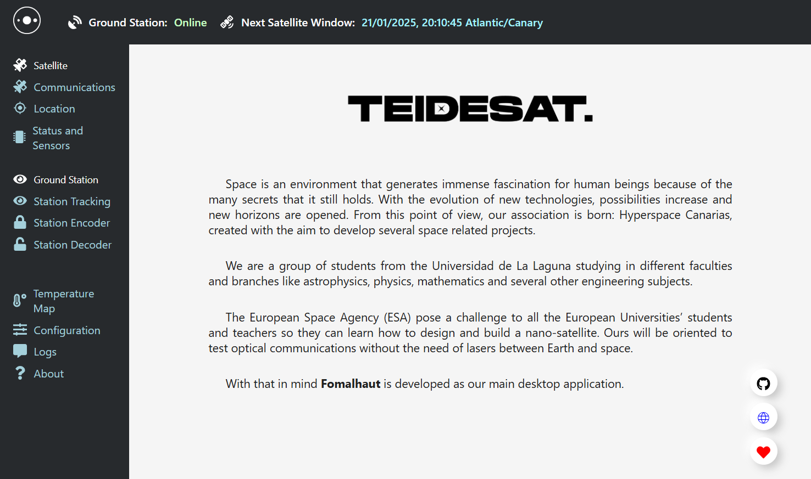

# Fomalhaut
[](https://nodejs.org/es/download/)
[](https://nodejs.org/es/download/)
[](https://www.gnu.org/licenses/gpl-3.0)

> From TEIDESAT Project and Hyperspace Canarias



## Description

This software is designed as a general purpose cross-platform application for the TeideSat Project. The interface (`React`)
will connect to the local server (`java-spring`) by default or any other remote server (_note, for debugging purposes, the
interface can be accessed through the browser_).

## Usage

```git clone https://github.com/AlvaroRGZ/Fomalhaut-Frontend```

```cd Fomalhaut-Frontend```

```npm install```

```npm run dev```

